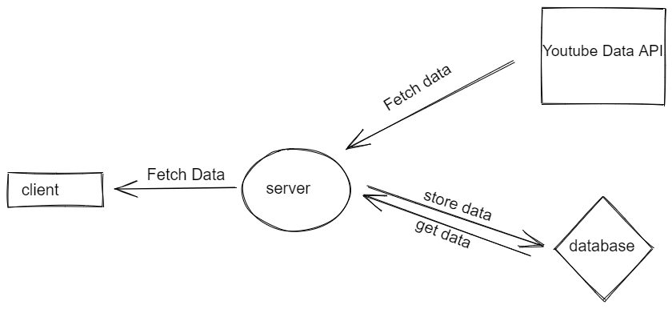

# Application that uses Youtube data API.

## Getting started

### Installation

- `npm install`
- `cd client` -> `npm install`

### Starting nodejs application [server]

`npm start`

You will see any lint errors in the console if there are any.
Run the application on port 5000.

### Create indexes for searching

run in mongoshell [open cmd and run `mongo`, mongoshell will open]

- `use youtube`
- `db.videos.createIndex( { title: "text", description: "text" } )`
  know more [here](https://docs.mongodb.com/manual/text-search/).

### Starting reactjs application [client]

`cd client`
`npm start`

Runs the app in the development mode on port 3000.
Open [http://localhost:3000](http://localhost:3000) to view it in the browser.

The page will reload if you make edits.
You will also see any lint errors in the console.

### Exposed API end points: -

- > GET _[http://localhost:5000/api/youtube/videodata](http://localhost:5000/api/youtube/videodata)_

  - returns the stored video data in a paginated response sorted in descending order of published datetime.
  - `page` query parameter, it could take values `1, 2, 3, ...`.
  - Open [http://localhost:5000/api/youtube/videodata?page=1](http://localhost:5000/api/youtube/videodata?page=1) to view responses in the browser.

- > GET _[http://localhost:5000/api/youtube/search](http://localhost:5000/api/youtube/search)_
  - A basic search API to search the stored videos using their title and description.
  - returns the stored video data in paginated resposne depending on `q`.
  - `q` and `page` are query paramaters. The q parameter specifies the query term to search for.
  - Open [http://localhost:5000/api/youtube/search?q='official'&page=1](http://localhost:5000/api/youtube/search?q='official'&page=1) to view responses in the browser.

## Approach

After Each 10s using our nodejs server application make a request to fetch the youtube video data and store in database using [Google APIs Node.js Client Module](https://github.com/googleapis/google-api-nodejs-client). [code -> **search** folder].

